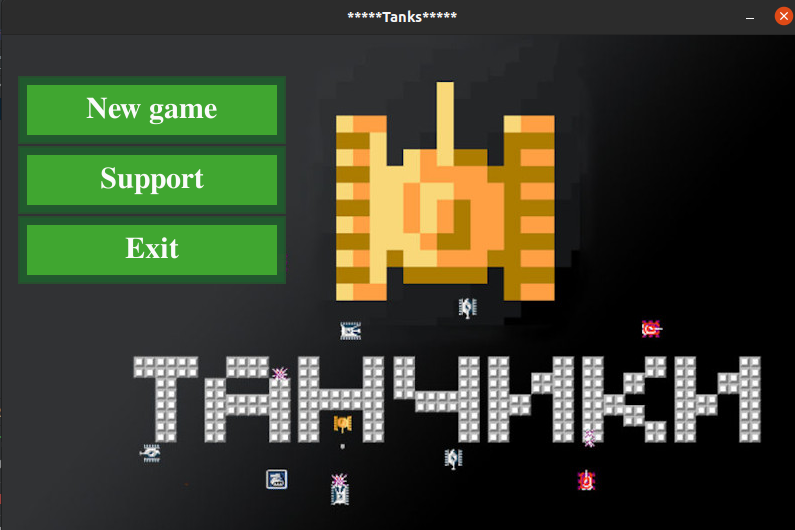
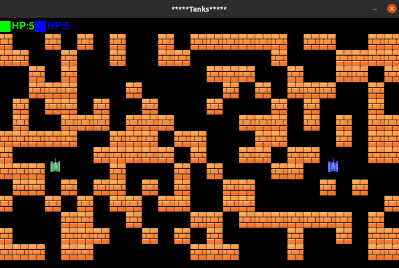
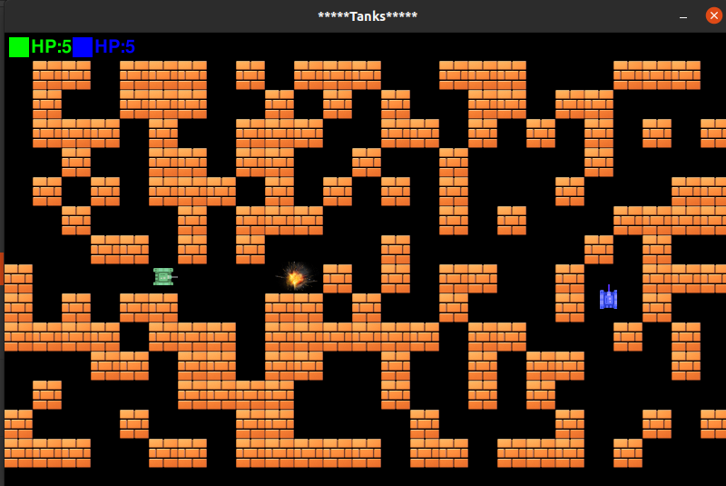
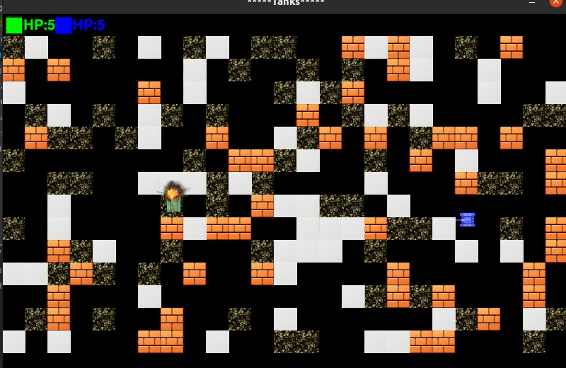
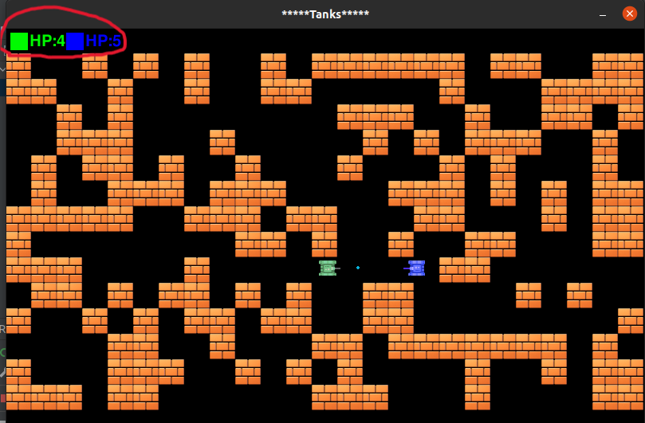

# **Танки на двоих**


___

## **Описание**
**Танки на двоих** — локальная компьютерная игра для двух игроков.

В игре досупны два танка для двух игроков с собственным набором комманд управления для каждого танка. Полигон действий виден сверху. Каждый игрок, управляя своим танком, должен уничтожить его. Если игрок уничтожит соперника лишив при этом всех его жизней — игра окончена. При этом на карте приутсвуют кирпичные блоки преднзначенные в качестве укрытий от снарядлов противника и также они служат преградой для быстрого уничтожения вражеского танка. Игра продолжается до того момента как будет определен победитель.
____

## **Как играть**
Процесс игры очень прост. После запуска игры откроется меню игры



где вы можете нажать на кнопки `New game`,  `Support`, `Exit`.

* `New game` - начинает игру
* `Support` - направяет пользователя на страничку разработчика в [ВКонтакте](https://vk.com)
* `Exit` - закрывает игру

Кнопки меняют цвет при наведении на них курсора

Игру можно будет закрыть в любое время кнопкой [:negative_squared_cross_mark:] на правом верхнем углу окошки приложения.

### **Старт игры**
После нажатия кнопки `New game` будет открыто поле боя где уже будут расположены танки игроков.



Далее вы можете начать игру управляя своим танком.

___
#### **Cписок командля для управления танком**
 ***Для первого игрока:***
* `W` - движение вперёд
* `S` - движение вниз
* `D` - движение вправо
* `A` - движение влево
* `SPACE` - стрельба

 ***Для второго игрока:***
* `СТРЕЛКА_ВВЕРХ` - движение вперёд
* `СТРЕЛКА_ВНИЗ` - движение вниз
* `СТРЕЛКА_ВПРАВО` - движение вправо
* `СТРЕЛКА_ВЛЕВО` - движение влево
* `SPACE` - стрельба

____

Кирпичные блоки имеют хрупкую струтуру и поэтому уничтожаются за один выстрел танка. При столкновении пули с объектом происходит взрыв с уничтожением пули и объекта столкновения: кирпичного блока(при столкновении с ним), танка(при условии что жизнь танка после попадания в него пули равна нулю)






На левом углу окошки будут отображаться оставшие жизни каждого игрока.




Если значение жизни опустится ниже одного, то такн уничтожиться, что вовлечёт с собой завершение игры и вывод результата битвы,


где будет отображён победитель боя вместе с его оставшимися жизнями, а также кнопки для выхода из игры и возрата в главное меню.

Кнопки на окошке с результатом обладают теми же свойствами что и кнопки на главном меню.

___

## **Установка**

Для того, чтобы установить игру наберите в терминале:
```
git clone https://github.com/allaberenov/kerim.git
cd kerim
```

### **Установка необходимых пакетов**

Для того чтобы запустить игру вам поналобиться язык программирования [Python](https://www.python.org). Для установки языка (если он у вас ранее не был установлен) введите нижеуказанные команды в терминал.

```
sudo apt update
sudo apt install python3.9

```
___

## **Запуск игры**

Для того чтобы запустить игру введите в терминал команду:

```
cd Tank/src
python3 Tank.py

```
___

## **Детали разработки**

Игра создавалась с помощью игрового модуля [Pygame](https://www.pygame.org), в среде разработки [VS Code](https://code.visualstudio.com). В основе игры лежит знаменитая игра [Battle City](https://ru.wikipedia.org/wiki/Battle_City)

Проект состоит из семи отдельных файлов с исходным кодом. 

* В модуле `Tanks.py` описан вызов игры, меню и результатов в соответствующее время.
* В модуле `factory.py` реализованы основные классы и функции для создания игровых объектов и их отрисовки на окне
* В модуле `play.py` описана реализация игрового процесса
* В модуле `menu_attributes.py` реализован класс `Button` который применяется в графическом меню
* В модулях `graph_interface`, `game_menu`, `game_results` реализованы меню игры и отображение результатов поединка.

___
# **Весёлой игры [:smile:]!**
